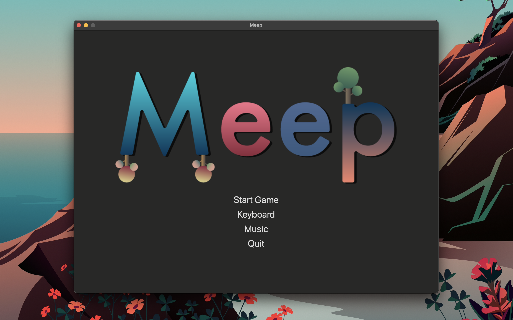
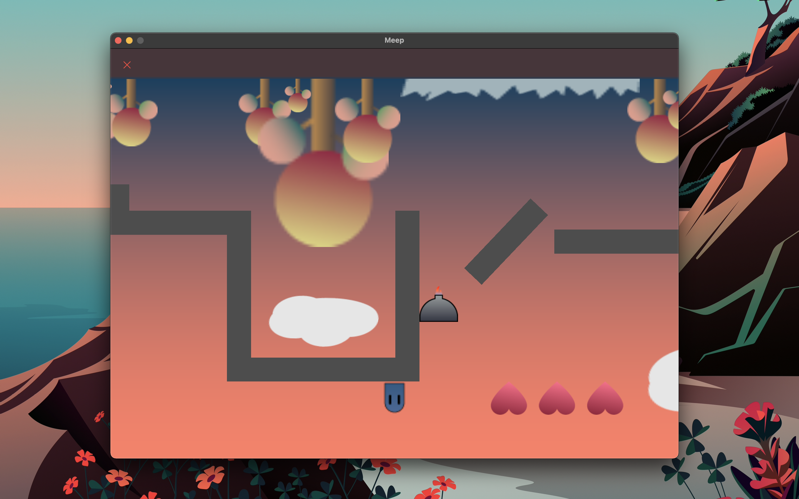
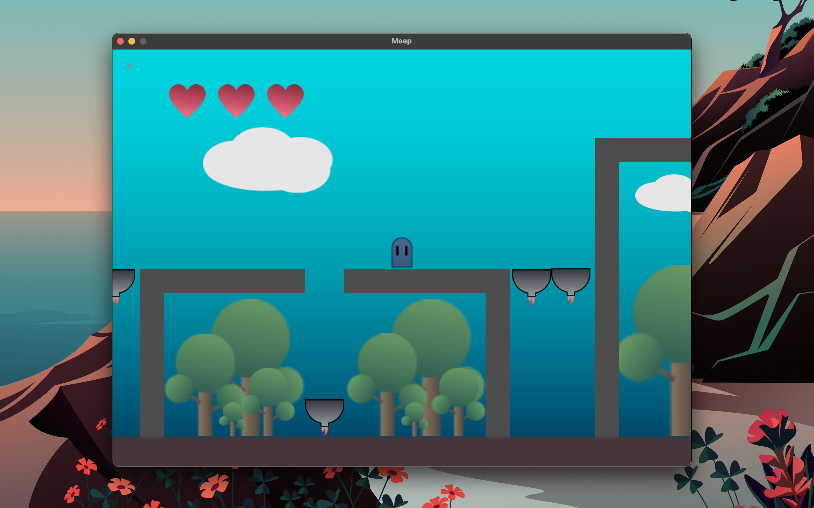

<h1 align="center">
 

 
</h1>

<h3 align="center">Meep is a game with two different worlds and only one mission.</h3>

---

### Sommaire
 - [Description](#description)
 - [Next Change](#next-change)
 - [Contributor](#contributor)

---

# Description
Meep is a little blue ghost, he lives in a universe where all ghost are blue, but Meep is not a ghost like the others...
Meep is a transgender ghost... She dreams of becoming a pink ghost in the other universe.

Meep is created for the **Swift Student Challenge** 2020 and is one of the 350 winners !!

## Preview
<h1 align="center">
 

 
</h1>

## Link
 - [Mac AppStore](https://apps.apple.com/us/app/meep-the-game/id1553783197)

# Next Change
 - New Level, new history

# Contributor
[Louise Pieri](https://github.com/lpieri)
