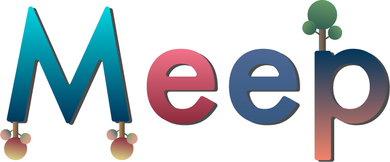
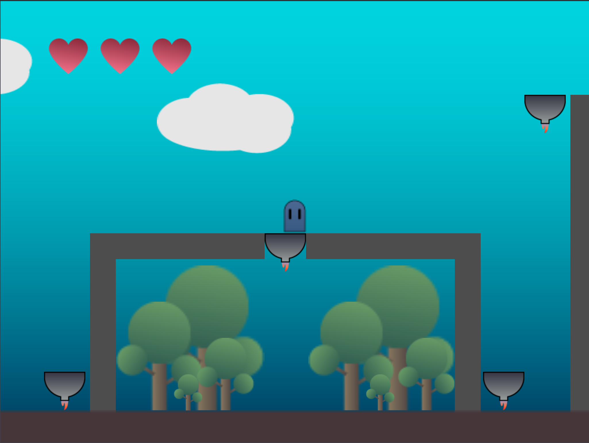
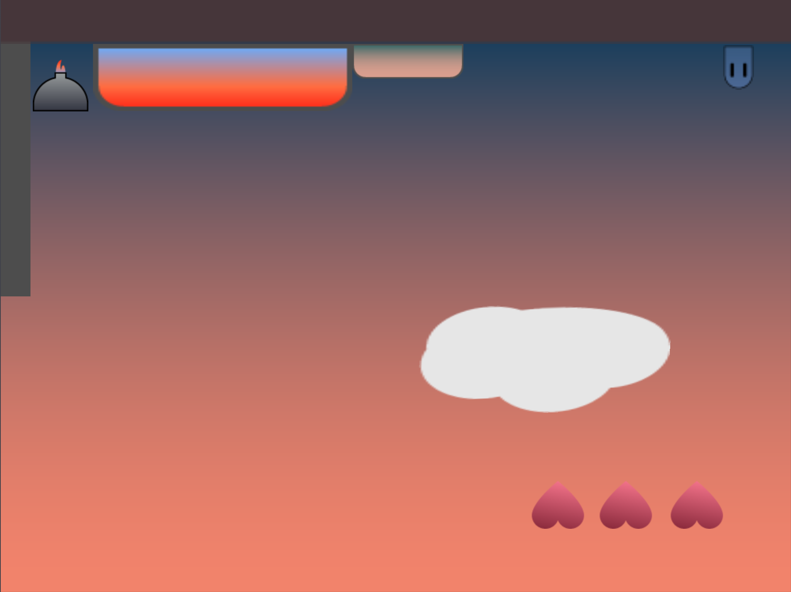

<h1 align="center">
 

 
</h1>

<h3 align="center">Meep is a game with two different worlds and only one mission.</h3>

---

## Description

Meep is a little blue monster, he lives in a universe where all monsters are blue, but Meep is not a monster like the others...

Meep is a transgender monster... She dreams of becoming a pink monster in the other universe.

## Swift Student Challenge Result

Meep is one of the 350 winners !!

## Link

 - [Mac AppStore](https://apps.apple.com/us/app/meep-game/id1553783197)

## Next Change

 - Parallax Effect

## Preview

<h1 align="center">
 

 
</h1>

## Contributor

[Louise Pieri](https://github.com/lpieri)
